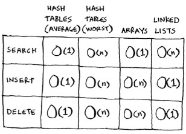
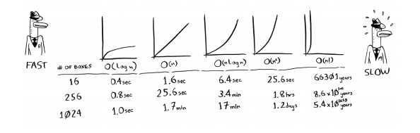

# Algoritmos

Estos programas/apuntes han sido tomados para seguir los contenidos del libro Grokking Algorithms.

## Estructuras de datos y complejidades

## Métricas de evaluación

A continuación se adjunta una tabla con la estimación en tiempo de las complejidades más populares:

En cuando a la notación, cabe destacar que en caso de una complejidad ` O(n)`, el coste real en tiempo es `c*n`, siendo
`c` una cantidad determinada de tiempo que se requiere en cada paso.

A este valor se le llama `constante`. Generalmente suele ser ignorada ya que no es determinante en la mayoría de casos,
salvo en alguna excepción que se verá más adelante, al evaluar la eficiencia del algoritmo `quicksort`. 

## Estrategias de resolución

### Recursión

Las funciones recursivas constan de al menos dos elementos, el caso base y el caso recursivo.

El caso base cuando se trata de colecciones suele referirse a cuando éstas tienen ninguno o un elemento. En caso de no tener claro cual puede ser el caso base en un algoritmo, probar estas opciones primero.

### Divide y vencerás

Uno de los ejemplos del uso de esta técnica es la ordenación denominada `quicksort`.

#### Quicksort

En el caso peor, su complejidad puede ser cuadrática, pero en el caso medio su complejidad es `O(n*log n)`, siendo tan
óptima como la alcanzada en el algoritmo `mergesort`.

El caso medio mencionado se alcanzará siempre que el elemento seleccionado como `pivot` sea un elemento aleatorio de la
colección.

Dado que la constante de este algoritmo es más baja que en `mergesort`, esto le convierte en el algoritmo de ordenación
más eficiente.

### Búsqueda en anchura

Esta estrategia se aplica a problemas que pueden ser representados mediante grafos.

Permite dar respuesta a las cuestiones:

- ¿Hay un camino desde un nodo hasta otro?
- ¿Cuál es el camino más corto desde un nodo hasta otro?